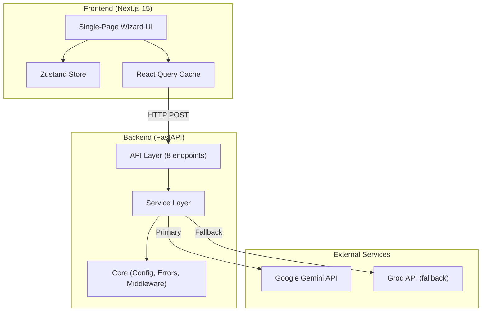
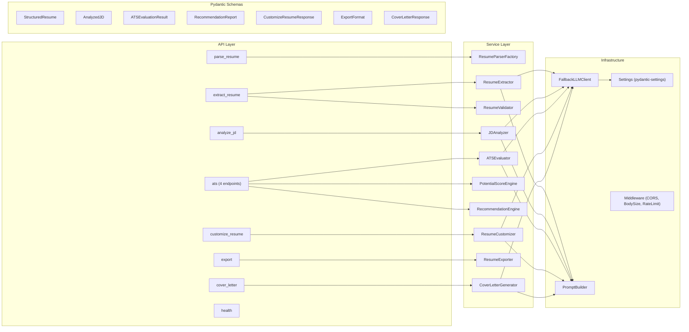
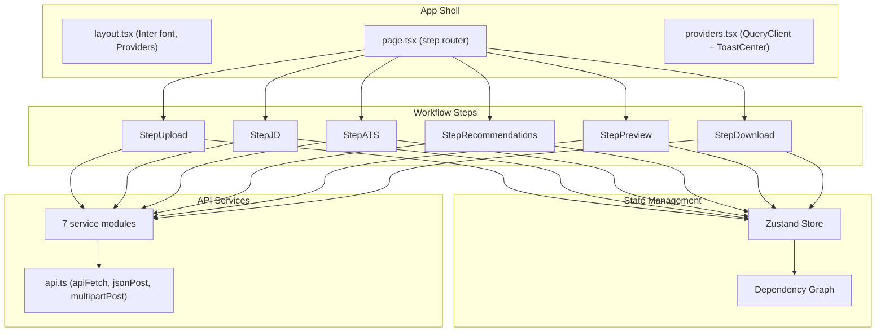

# ResumeTailor AI

[](https://opensource.org/licenses/MIT)

AI-powered resume tailoring application that optimizes resumes for specific job postings using LLM analysis, ATS scoring, and intelligent recommendations.

---

## Table of Contents

- [Tech Stack](#tech-stack)
- [High-Level Design (HLD)](#high-level-design-hld)
- [Low-Level Design (LLD)](#low-level-design-lld)
- [Project Structure](#project-structure)
- [Local Setup](#local-setup)
- [Environment Variables](#environment-variables)
- [API Reference](#api-reference)
- [Adding Shadcn UI Components](#adding-shadcn-ui-components)

---

## Tech Stack

| Layer      | Technology                                                    |
|------------|---------------------------------------------------------------|
| Frontend   | Next.js 15, React 19, TypeScript 5, Tailwind CSS, shadcn/ui  |
| Backend    | FastAPI 0.115, Python 3.10+, Pydantic 2, Uvicorn             |
| State      | Zustand 5, TanStack React Query 5                            |
| Forms      | React Hook Form 7 + Zod 3                                    |
| LLM        | Google Gemini (primary), Groq/Llama (fallback)               |
| File Parse | PyMuPDF (PDF), python-docx (DOCX)                            |
| Rate Limit | SlowAPI (in-memory, per-IP)                                  |

---

## High-Level Design (HLD)

### System Overview

ResumeTailor AI is a single-page web application with a decoupled frontend/backend architecture. Users interact with a 6-step wizard that uploads a resume, analyzes a job description, evaluates ATS compatibility, generates improvement recommendations, applies optimizations via LLM, and exports the final document.



### Workflow Steps

| Step | Name              | Type        | Description                                                 |
|------|-------------------|-------------|-------------------------------------------------------------|
| 1    | Upload Resume     | LLM-powered | Parse PDF/DOCX → extract structured data via LLM → validate |
| 2    | Job Description   | LLM-powered | Analyze JD → extract role, skills, keywords, seniority      |
| 3    | ATS Analysis      | Mixed       | LLM scores resume, deterministic engines predict potential   |
| 4    | Recommendations   | Deterministic + LLM | Generate recommendations (deterministic), apply via LLM |
| 5    | Preview           | Client-only | Diff view of original vs. optimized resume                  |
| 6    | Download          | Mixed       | Export PDF/DOCX (deterministic), cover letter (LLM)         |

### Key Architectural Decisions

- **Stateless backend** — no database, no sessions; all state lives in the frontend Zustand store. Each API call is self-contained.
- **Fallback LLM strategy** — Gemini is primary with retry logic; if it fails, Groq handles the request. Non-retryable errors (invalid API key, quota exceeded) skip retries immediately.
- **Deterministic vs. LLM separation** — Recommendation generation and potential score prediction are fully deterministic (zero API cost, <1ms, reproducible). Only extraction, analysis, evaluation, customization, and cover letter use LLM.
- **Identity preservation** — The resume customizer hard-overwrites identity fields (name, email, phone, education) from the original resume after LLM processing, preventing hallucination of personal data.
- **Downstream invalidation** — The Zustand store maintains a dependency graph. Changing an upstream step (e.g., re-uploading a resume) automatically invalidates all downstream cached results (ATS scores, recommendations, etc.).

---

## Low-Level Design (LLD)

### Backend Architecture



### Service Details

#### FallbackLLMClient

```
Primary: GeminiClient (temp=0.1, response_mime_type=application/json)
    ↓ on failure (with _should_retry check)
Secondary: GroqClient (temp=0.1, response_format=json_object)

Non-retryable signals: invalid API key, quota exceeded, model not found
Retry strategy: linear backoff, configurable max retries (default 2)
```

#### Resume Validation Pipeline (3 layers)

```
Layer 1: File validation — extension + MIME type + size (≤10MB)
Layer 2: Confidence scoring — deterministic 0-100 score based on field presence
    • <30  → reject (not a resume)
    • 30-70 → Layer 3
    • >70  → accept
Layer 3: AI verification — LLM classifies first 3000 chars as resume/non-resume
    • fail-open on LLM error (accepts the document)
```

#### ResumeParserFactory (Strategy Pattern)

```
Strategies:
    .pdf  → PDFParser (PyMuPDF / fitz)
    .docx → DOCXParser (python-docx)

Validates: file extension ↔ content-type match
Output: raw text string (whitespace-normalized)
```

#### Recommendation Engine (Deterministic)

10 group builders run sequentially:

| # | Group                    | Source                            |
|---|--------------------------|-----------------------------------|
| 1 | Missing Keywords         | ATS evaluation matched/missing    |
| 2 | Missing Required Skills  | JD required vs. resume skills     |
| 3 | Missing Preferred Skills | JD preferred vs. resume skills    |
| 4 | Experience Quality       | Resume experience vs. ATS score   |
| 5 | Summary Optimization     | Resume summary vs. JD role        |
| 6 | Skills Section           | Resume skills vs. ATS score       |
| 7 | Projects                 | Resume projects vs. JD alignment  |
| 8 | Education                | Resume education vs. ATS score    |
| 9 | Role Tailoring           | JD role/seniority vs. resume      |
| 10| Formatting               | Resume structural quality         |

Point normalization: Hamilton/largest-remainder method distributes budget (100 − current score) across all recommendations proportionally by impact weight.

#### Potential Score Engine (Deterministic)

```
Per-dimension uplift estimators → raw predicted score
Seniority gap ceiling: 0 levels → cap 98, 1 → 94, 2 → 88, 3 → 82, 4+ → 75
Action count ceiling applied
Floor: never below current score
```

#### Prompt System

5 prompt types registered in `PROMPT_REGISTRY`:

| Type                  | Used By             |
|-----------------------|---------------------|
| RESUME_EXTRACTION     | ResumeExtractor     |
| JD_ANALYSIS           | JDAnalyzer          |
| ATS_EVALUATION        | ATSEvaluator        |
| RESUME_CUSTOMIZATION  | ResumeCustomizer    |
| COVER_LETTER          | CoverLetterGenerator|

Each template contains a system instruction + user template with `{variable}` placeholders filled by `PromptBuilder.build()`.

### Frontend Architecture



#### Zustand Store — Dependency Graph

When upstream data changes, all downstream cached results are invalidated:

```
upload ──→ ats ──→ optimize ──→ download
  │                   ↑
  └──→ jd ───→ ats ──┘
```

Example: Re-uploading a resume clears ATS scores, optimization results, and download state. Re-entering a JD clears ATS scores and everything downstream. The JD text itself is preserved when only the resume changes.

#### API Client

- Base URL from `NEXT_PUBLIC_API_URL` (defaults to `http://localhost:8000`)
- 45-second timeout via AbortController (60s for exports)
- Automatic toast-on-error for all failed requests
- Zod runtime validation on ATS and cover letter responses

---

## Project Structure

```
ResumeTailor-AI/
├── .env.example                    # Root env template (all variables)
├── README.md
│
├── backend/
│   ├── main.py                     # FastAPI app entry (lifespan, CORS, routers)
│   ├── requirements.txt            # Python dependencies
│   ├── .env.example                # Backend env template
│   │
│   ├── api/                        # Route handlers
│   │   ├── router.py               # Versioned router aggregator
│   │   ├── parse_resume.py         # POST /api/parse-resume
│   │   ├── extract_resume.py       # POST /api/extract-resume
│   │   ├── analyze_jd.py           # POST /api/analyze-jd
│   │   ├── ats.py                  # POST /api/ats/{analyze,potential,recommendations,compare}
│   │   ├── customize_resume.py     # POST /api/customize-resume
│   │   ├── export.py               # POST /api/export
│   │   ├── cover_letter.py         # POST /api/cover-letter
│   │   └── v1/
│   │       └── health.py           # GET /api/v1/health
│   │
│   ├── core/                       # Infrastructure
│   │   ├── config.py               # Settings (pydantic-settings) + rate limiter
│   │   ├── errors.py               # AppError + global exception handlers
│   │   ├── logging.py              # JSON/text log config
│   │   └── middleware.py           # MaxBodySizeMiddleware
│   │
│   ├── schemas/                    # Pydantic request/response models
│   │   ├── extract_resume.py       # StructuredResume (central schema)
│   │   ├── analyze_jd.py           # AnalyzedJD
│   │   ├── ats.py                  # ATS request models
│   │   ├── ats_models.py           # ATS evaluation/recommendation models
│   │   ├── customize_resume.py     # Customization models
│   │   ├── cover_letter.py         # Cover letter models
│   │   ├── export.py               # ExportFormat enum + request
│   │   ├── parse_resume.py         # Parse response
│   │   └── health.py               # Health response
│   │
│   ├── services/                   # Business logic
│   │   ├── llm/                    # LLM client layer
│   │   │   ├── clients.py          # GeminiClient, GroqClient, FallbackLLMClient
│   │   │   └── __init__.py         # llm_client singleton
│   │   ├── prompt_builder/         # Prompt template system
│   │   │   ├── types.py            # PromptType enum
│   │   │   ├── templates.py        # PROMPT_REGISTRY (5 templates)
│   │   │   └── builder.py          # PromptBuilder class
│   │   ├── resume_parser/          # File text extraction
│   │   │   ├── parser_factory.py   # Strategy pattern dispatcher
│   │   │   ├── pdf_parser.py       # PyMuPDF extraction
│   │   │   └── docx_parser.py      # python-docx extraction
│   │   ├── resume_extractor/       # LLM structured extraction
│   │   │   └── extractor.py        # ResumeExtractor
│   │   ├── resume_validator/       # 3-layer validation
│   │   │   ├── validator.py        # Confidence scoring (deterministic)
│   │   │   └── ai_verifier.py      # AI document classification
│   │   ├── jd_analyzer/            # JD analysis
│   │   │   └── analyzer.py         # JDAnalyzer
│   │   ├── ats/                    # ATS scoring system
│   │   │   ├── ats_evaluator.py    # LLM-powered ATS evaluation
│   │   │   ├── potential_score_engine.py  # Deterministic prediction
│   │   │   └── recommendation_engine.py  # Deterministic recommendations
│   │   ├── resume_customizer/      # LLM resume rewriting
│   │   │   └── customizer.py       # ResumeCustomizer
│   │   ├── export_service/         # Document generation
│   │   │   └── exporter.py         # PDF/DOCX builder
│   │   ├── cover_letter_generator/ # Cover letter
│   │   │   └── generator.py        # CoverLetterGenerator
│   │   └── parse_resume_service.py # Upload validation + text cleaning
│   │
│   └── tmp/uploads/                # Temporary file storage (cleaned on startup)
│
└── frontend/
    ├── package.json                # Dependencies + scripts
    ├── next.config.ts              # Next.js config (typed routes)
    ├── tailwind.config.ts          # Tailwind + shadcn theme
    ├── tsconfig.json               # TypeScript (strict, @/* alias)
    ├── components.json             # shadcn/ui CLI config
    ├── .eslintrc.json              # ESLint (next + prettier)
    ├── .prettierrc                 # Prettier config
    ├── .env.local.example          # Frontend env template
    │
    └── src/
        ├── app/
        │   ├── layout.tsx          # Root layout (font, providers)
        │   ├── page.tsx            # Main page (step router)
        │   ├── providers.tsx       # QueryClient + ToastCenter
        │   └── globals.css         # CSS theme variables
        │
        ├── components/
        │   ├── ats/                # ATS visualization components
        │   │   ├── ATSScoreCard.tsx       # Animated circle gauge
        │   │   ├── ATSBreakdown.tsx       # 5-dimension bar chart
        │   │   ├── ATSComparisonCard.tsx  # Before/after comparison
        │   │   ├── MatchedKeywords.tsx    # Green keyword badges
        │   │   └── MissingKeywords.tsx    # Red keyword badges
        │   ├── recommendations/    # Recommendation UI
        │   │   ├── RecommendationPanel.tsx      # Full panel container
        │   │   ├── RecommendationGroupCard.tsx  # Collapsible group
        │   │   ├── RecommendationItem.tsx       # Individual item
        │   │   ├── RecommendationToolbar.tsx    # Search + bulk select
        │   │   ├── ImpactBadge.tsx              # Impact level pill
        │   │   └── ATSGainSummary.tsx           # Score projection grid
        │   ├── resume/             # Resume display
        │   │   ├── ResumeView.tsx         # Formatted resume render
        │   │   └── ResumeDiff.tsx         # Before/after diff
        │   ├── cover-letter/
        │   │   └── CoverLetterTab.tsx     # Cover letter generation
        │   └── ui/                 # shadcn/ui primitives
        │       ├── button.tsx, card.tsx, input.tsx, textarea.tsx
        │       ├── badge.tsx, separator.tsx
        │       └── toast-center.tsx       # Event-driven toasts
        │
        ├── features/
        │   ├── workflow/
        │   │   ├── types/
        │   │   │   └── workflow.types.ts  # All shared TS types
        │   │   ├── store/
        │   │   │   └── workflow.store.ts  # Zustand store + dependency graph
        │   │   ├── services/             # API service modules
        │   │   │   ├── api.ts                    # Core HTTP client
        │   │   │   ├── parse-resume.service.ts   # File upload
        │   │   │   ├── extract-resume.service.ts # Structured extraction
        │   │   │   ├── analyze-jd.service.ts     # JD analysis
        │   │   │   ├── ats.service.ts            # ATS operations
        │   │   │   ├── customize-resume.service.ts # Optimization
        │   │   │   ├── export-resume.service.ts  # PDF/DOCX download
        │   │   │   └── cover-letter.service.ts   # Cover letter
        │   │   └── components/           # Step components
        │   │       ├── WorkflowStepper.tsx
        │   │       ├── StepUpload.tsx
        │   │       ├── StepJD.tsx
        │   │       ├── StepATS.tsx
        │   │       ├── StepRecommendations.tsx
        │   │       ├── StepPreview.tsx
        │   │       └── StepDownload.tsx
        │   └── resume-upload/
        │       └── schemas/
        │           └── upload-resume.schema.ts   # Zod file validation
        │
        └── lib/
            ├── utils.ts            # cn() class name utility
            └── toast.ts            # Event-driven toast system
```

---

## Local Setup

### Prerequisites

| Tool       | Version  | Required |
|------------|----------|----------|
| Node.js    | ≥ 20     | Yes      |
| Python     | ≥ 3.10   | Yes      |
| npm        | ≥ 9      | Yes      |
| pip        | latest   | Yes      |
| Gemini API Key | —   | Yes (primary LLM) |
| Groq API Key   | —   | No (fallback LLM) |

### Step 1 — Clone the Repository

```bash
git clone https://github.com/<your-username>/ResumeTailor-AI.git
cd ResumeTailor-AI
```

### Step 2 — Backend Setup

```bash
cd backend

# Create virtual environment
python -m venv .venv

# Activate virtual environment
# Windows:
.venv\Scripts\activate
# macOS/Linux:
source .venv/bin/activate

# Install dependencies
pip install -r requirements.txt

# Create environment file
cp .env.example .env
```

Edit `backend/.env` and add your API keys:

```env
GEMINI_API_KEY=your_actual_gemini_key
GROQ_API_KEY=your_actual_groq_key      # optional, for fallback
```

Start the backend server:

```bash
uvicorn main:app --reload --host 0.0.0.0 --port 8000
```

The API is now running at `http://localhost:8000`. Interactive docs at `http://localhost:8000/docs`.

### Step 3 — Frontend Setup

Open a new terminal:

```bash
cd frontend

# Install dependencies
npm install

# Create environment file
cp .env.local.example .env.local
```

The default `NEXT_PUBLIC_API_URL=http://localhost:8000` should work if the backend is on the same machine. Edit if your backend runs elsewhere.

Start the frontend dev server:

```bash
npm run dev
```

The app is now running at `http://localhost:3000`.

### Step 4 — Verify

1. Open `http://localhost:3000` in your browser
2. Backend health check: `curl http://localhost:8000/api/v1/health` → `{"status":"ok"}`
3. Upload a PDF/DOCX resume and test the full workflow

### Available Scripts

**Frontend:**

```bash
npm run dev            # Dev server with Turbopack (http://localhost:3000)
npm run build          # Production build
npm run start          # Start production server
npm run lint           # ESLint check
npm run lint:fix       # ESLint auto-fix
npm run format         # Prettier format all files
npm run format:check   # Prettier dry-run
npm run type-check     # TypeScript type check (no emit)
```

**Backend:**

```bash
uvicorn main:app --reload --host 0.0.0.0 --port 8000    # Dev server with hot reload
uvicorn main:app --host 0.0.0.0 --port 8000              # Production server
```

---

## Environment Variables

### Backend (`backend/.env`)

| Variable                | Default                         | Description                                      |
|-------------------------|---------------------------------|--------------------------------------------------|
| `PROJECT_NAME`          | `ResumeTailor AI`               | Application name                                 |
| `VERSION`               | `0.1.0`                         | API version string                               |
| `API_V1_PREFIX`         | `/api/v1`                       | Versioned API route prefix                       |
| `ALLOWED_ORIGINS`       | `["http://localhost:3000"]`     | CORS allowed origins                             |
| `ALLOWED_METHODS`       | `["GET","POST","OPTIONS"]`      | CORS allowed methods                             |
| `ALLOWED_HEADERS`       | `["Content-Type"]`              | CORS allowed headers                             |
| `TEMP_UPLOAD_DIR`       | `./tmp/uploads`                 | Temporary file upload directory (cleaned on boot)|
| `MAX_UPLOAD_SIZE_BYTES` | `10485760` (10 MB)              | Maximum upload file size                         |
| `MAX_REQUEST_BODY_BYTES`| `2097152` (2 MB)                | Maximum JSON request body size                   |
| `RATE_LIMIT_LLM`        | `10/minute`                     | Per-IP rate limit for LLM endpoints              |
| `LOG_FORMAT`            | `json`                          | Log format: `json` or `text`                     |
| `GEMINI_API_KEY`        | *(empty)*                       | **Required.** Google Gemini API key              |
| `GEMINI_MODEL`          | `gemini-2.5-flash`              | Gemini model name                                |
| `GEMINI_MAX_RETRIES`    | `2`                             | Max retry attempts per LLM call                  |
| `LLM_TIMEOUT_SECONDS`   | `30`                            | LLM request timeout                              |
| `GROQ_API_KEY`          | *(empty)*                       | Groq API key (optional fallback)                 |
| `GROQ_MODEL`            | `llama-3.3-70b-versatile`       | Groq model name                                  |

### Frontend (`frontend/.env.local`)

| Variable              | Default                   | Description              |
|-----------------------|---------------------------|--------------------------|
| `NEXT_PUBLIC_API_URL` | `http://localhost:8000`   | Backend API base URL     |

---

## API Reference

### Endpoints

| Method | Path                         | Rate Limited | Description                              |
|--------|------------------------------|:------------:|------------------------------------------|
| GET    | `/api/v1/health`             | No           | Health check                             |
| POST   | `/api/parse-resume`          | No           | Upload PDF/DOCX → raw text               |
| POST   | `/api/extract-resume`        | Yes          | Raw text → structured resume JSON        |
| POST   | `/api/analyze-jd`            | Yes          | Job description → structured analysis    |
| POST   | `/api/ats/analyze`           | Yes          | Resume + JD → ATS evaluation scores      |
| POST   | `/api/ats/potential`         | No           | Predict max achievable ATS score         |
| POST   | `/api/ats/recommendations`   | No           | Generate improvement recommendations     |
| POST   | `/api/ats/compare`           | Yes          | Compare before/after ATS scores          |
| POST   | `/api/customize-resume`      | Yes          | Apply recommendations → optimized resume |
| POST   | `/api/export`                | No           | Structured resume → PDF/DOCX binary      |
| POST   | `/api/cover-letter`          | Yes          | Generate a tailored cover letter         |

### Health Check

```
GET /api/v1/health
```

```json
{
  "status": "ok"
}
```

Interactive API docs (Swagger UI) are available at `http://localhost:8000/docs`.

---

## Adding Shadcn UI Components

```bash
cd frontend
npx shadcn@latest add button
npx shadcn@latest add input
npx shadcn@latest add card
```

Components are placed in `src/components/ui/` automatically. Configuration lives in `components.json`.

---

## License

MIT © [Pranshu Chaurasia](https://pranshuchaurasia.dev)
